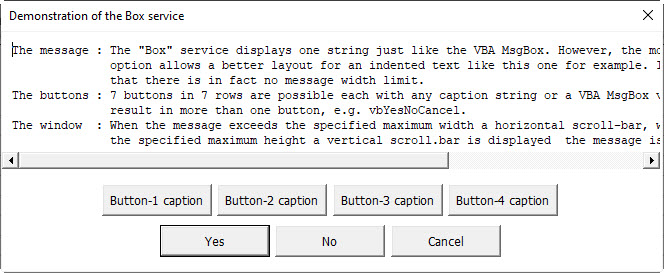
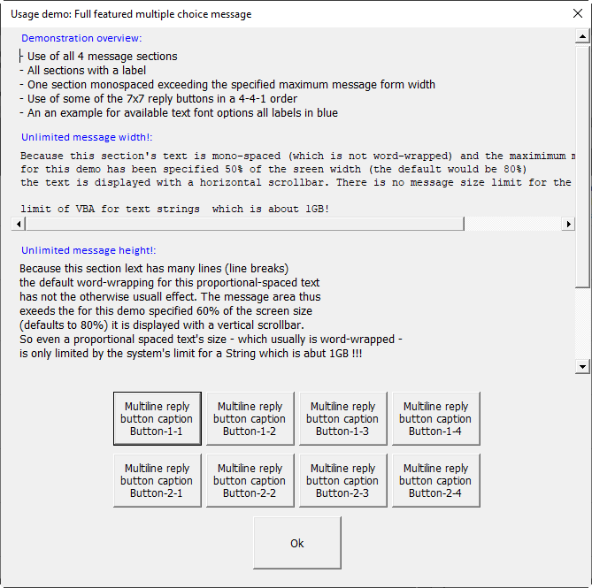
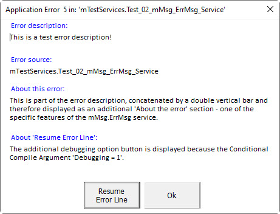

# Common VBA Message Service (a MsgBox Alternative)

[Summary](#summary)<br>
[Why an alternative MsgBox?](#why-an-alternative-msgbox)<br>
[Installation](#installation)<br>
[Usage](#usage)<br>
&nbsp;&nbsp;&nbsp;[The Box service](#the-box-service)<br>
&nbsp;&nbsp;&nbsp;&nbsp;&nbsp;&nbsp;[Syntax](#syntax)<br>
&nbsp;&nbsp;&nbsp;&nbsp;&nbsp;&nbsp;[_Box_ service usage example](#box-service-usager-example)<br>
&nbsp;&nbsp;&nbsp;[The Dsply service](#the-dsply-service)<br>
&nbsp;&nbsp;&nbsp;&nbsp;&nbsp;&nbsp;[Syntax](#syntax-1)<br>
&nbsp;&nbsp;&nbsp;&nbsp;&nbsp;&nbsp;[Syntax of the Type _TypeMsgLabel_](#syntax-of-the-type-typemsglabel)<br>
&nbsp;&nbsp;&nbsp;&nbsp;&nbsp;&nbsp;[Syntax of the Type _TypeMsgText_](#syntax-of-the-type-typemsgtext)<br>
&nbsp;&nbsp;&nbsp;&nbsp;&nbsp;&nbsp;[_Dsply_ service usage example](#dsply-service-usage-example)<br>
&nbsp;&nbsp;&nbsp;[The ErrMsg service](#the-errmsg-service)<br>
&nbsp;&nbsp;&nbsp;&nbsp;&nbsp;&nbsp;[Syntax](#syntax-2)<br>
&nbsp;&nbsp;&nbsp;&nbsp;&nbsp;&nbsp;[Usage example](#usage-example)<br>
&nbsp;&nbsp;&nbsp;[The Monitor service](#the-monitor-service)<br>
&nbsp;&nbsp;&nbsp;&nbsp;&nbsp;&nbsp;[Usage of the _Monitor_ service](#usage-of-the-monitor-service)<br>
&nbsp;&nbsp;&nbsp;[The Buttons service](#the-buttons-service)<br>
&nbsp;&nbsp;&nbsp;[The MsgInstance service](#the-msginstance-service)<br>
[Miscellaneous aspects](#miscellaneous-aspects)<br>
&nbsp;&nbsp;&nbsp;[Min/Max Message Width/Height](#minmax-message-widthheight)<br>
&nbsp;&nbsp;&nbsp;[Proportional versus Mono-spaced](#proportional-versus-mono-spaced)<br>
&nbsp;&nbsp;&nbsp;[Unambiguous procedure name](#unambiguous-procedure-name)<br>
&nbsp;&nbsp;&nbsp;[Multiple Monitor instances](#multiple-monitor-instances)<br>

## Summary
A flexible and powerful alternative to the `VBA.MsgBox`, providing four specific services:
- ***[Box](#the-box-service)***: a 'VBA.MsgBox` alike service with extended flexibility
- ***[Dsply](#the-dsply-service)***: a multi purpose message display service
- ***[ErrMsg](#the-errmsg-service)***: a service dedicated to the display of a well designed error message including a debugging option
- ***[Monitor](#the-monitor-service)***: a service to display the progress of any number of ongoing processes progress.

Below is an at-a-glance demonstration of the services capability. For those looking for a "fastpath" the code is available for download in the [MsgUsageDemo.xlsm][6] Workbook (mind the fact that the VB-Project needs to be signed or the Macro Security has to be changed. The code displays :<br>


## Why an alternative MsgBox?
The alternative implementation addresses many of the MsgBox's deficiencies - without re-implementing it to 100%.

|MsgBox|This "Common&nbsp;VBA&nbsp;Message&nbsp;Service"|
|------|-----------|
| The message width and height is limited and cannot be altered | The&nbsp;maximum&nbsp;width and&nbsp;height&nbsp;is&nbsp;specified as&nbsp;a percentage of the screen&nbsp;size&nbsp; which&nbsp;defaults&nbsp;to: 85%&nbsp;width and  85%&nbsp;height. A message which exceeds the limits is displayed with a horizontal and/or vertical scroll-bar.|
| When a message exceeds its size limit ("approximately 1024 characters, depending on the width of the characters used") it is truncated | In practice there's no size limit but the systems limit for a `String` type which is about 1GB (and the _Dsply_ service displays up to 4 strings!|
| The message is displayed with a proportional font | A message (section) string may optionally be displayed mono-spaced |
| Composing a fair designed message is time consuming and it is difficult to come up with a satisfying result | Up&nbsp;to&nbsp;3&nbsp; _Message&nbsp;Sections_ each with an optional _Message Text Label_ and a _Mono-spaced_ option allow an appealing design without any extra  effort |
| The maximum reply _Buttons_ is 3 | Up to 7 reply _Buttons_ may be displayed in up to 7 reply _Button Rows_ in any order (=49 buttons in total) |
| The caption of the reply _Buttons_ is specified by a [value](<https://docs.microsoft.com/de-DE/office/vba/Language/Reference/User-Interface-Help/msgbox-function#settings>) which results in 1 to 3 reply _Buttons_ with corresponding untranslated! native English captions | The caption of the reply _Buttons_ may be specified by the [VB MsgBox values](<https://docs.microsoft.com/de-DE/office/vba/Language/Reference/User-Interface-Help/msgbox-function#settings>) **and** additionally by any multi-line text (see [Syntax of the _buttons_ argument](#syntax-of-the-buttons-argument) |
| vbApplicationModal or vbSystemModal, no vbModeless option | The message can be displayed both ways which _modal_ (the default) or _modeless_. _modal_ equals to vbApplicationModal, there is (yet) no vbSystemModal option.|
| Specifying the default button | The default button may be specified as index or as the displayed caption. However, it cannot be specified as vbOk, vbYes, vbNo, etc. |
| Display of an alert image (?, !, etc.) | (yet) not implemented |
| not available           | An optional "Label" above a message section allows the specification of anything to open: URL, mailto, folder, file, or an application like Excel.|

## Installation
1. Download [fMsg.frm][1], [fMsg.frx][2], and [mMsg.bas][3] .
2. Import _fMsg.frm_ and _mMsg.bas_ to your VB-Project
4. In the VBE add a Reference to _Microsoft Scripting Runtime_
Note: The

## Usage
### The _Box_ service
The _Box_ service mimics the _VBA.MsgBox_ by displaying a single message string like the _VBA.MsgBox Prompt_ argument. However, due to the use of the _fMsg_ form there is no limit in the length of the message string but the systems limit which is about 1GB. With the exception of the box_msg argument all other arguments are identical w\ith the __Dsply_ service - just prefixed with box_ instead of dsply_.

#### Syntax
`mMsg.Box(Prompt, [Buttons], [Title], [box_monospaced], [box_button_default], [box_button_width_min], [box_return_index],  [box_width_min], [box_width_max], [box_height_min], [box_height_max])`

The _Box_ service has these named arguments:

| Argument                | Meaning                                              |
| ----------------------- | -----------------------------------------------------|
| `Title`                 | String expression displayed in the window handle bar |
| `Prompt`                | String expression displayed |
| `Buttons`               | Optional. Variant expression. Defaults to vbOkOnly. May be provided as a comma delimited String, a Collection, or a Dictionary, with each item specifying a displayed command button's caption or a button row break (vbLf, vbCr, or vbCrLf). Any of the items may be a string or a classic VBA.MsgBox values (see [The VBA.MsgBox buttons argument settings][4]. Items exceeding 49 captions are ignored, when no row breaks are specified max 7 buttons are displayed in a row. |
| `box_monospaced`       | Boolean expression, defaults to False, displays the `box_msg` with a monospaced font |
| `box_button_default`    | Optional, numeric expression, defaults to 1, identifies the default button, i.e. the nth button which has the focus
| `box_return_index`      | Optional, Boolean expression, default to False, indicates that the return value for the clicked button will be the index rather than its caption string. |
| `box_modeless` | Optional, Boolean expression, defaults to False. When True, the message is displayed mode-less |
| `box_width_min`         | Optional, numeric expression, defaults to 400, the minimum width in pt for the display of the message. |
| `box_width_max`         | Optional, numeric expression, defaults to 80, specifies the maximum message window width as % of the screen size. |
| `box_height_min`        | Optional, numeric expression, defaults to 20, specifies the minimum message window height as a percentage of the screen size. |
| `box_height_max`        | Optional, numeric expression, defaults to 70, specifies the maximum message window height of the screen size. |
| `box_buttons_width_min` | Optional, numeric expression, defaults to 70, specifies the minimum button width in pt |
| `box_pos`              | Optional, Variant expression, defaults to 3, specifies the _StartUpPosition_ of the message on screen.<br>- enManual (0)         = No initial setting specified<br>- enCenterOwner (1)    = Center on the item to which the UserForm belongs<br>- enCenterScreen (2)   = Center on the whole screen<br>- enWindowsDefault (3) = Position in upper-left corner of screen (default)<br>- a range object specifying top and left<br>- a string in the form "\<top>;\<left>" (mind the semicolon separator!). top and left are numeric values in pt. |

#### _Box_ service usage example
The below example uses the [_Buttons_](#the-buttons-service) service to specify the displayed buttons and their order. 
```
Public Sub Demo_Box_Service()
    Const PROC      As String = "Demo_Box_service"
    Const BTTN_1    As String = "Button-1 caption"
    Const BTTN_2    As String = "Button-2 caption"
    Const BTTN_3    As String = "Button-3 caption"
    Const BTTN_4    As String = "Button-4 caption"
    
    On Error GoTo eh
    Dim DemoMessage As String
    
    DemoMessage = "The message : The ""Box"" service displays one string just like the VBA.MsgBox. However, the mono-spaced" & vbLf & _
                  "              option allows a better layout for an indented text like this one for example. It should also be noted" & vbLf & _
                  "              that there is in fact no message width limit." & vbLf & _
                  "The buttons : 7 buttons in 7 rows are possible each with any caption string or a VBA MsgBox value. The latter may" & vbLf & _
                  "              result in more than one button, e.g. vbYesNoCancel." & vbLf & _
                  "The window  : When the message exceeds the specified maximum width a horizontal scroll-bar, when it exceeds" & vbLf & _
                  "              the specified maximum height a vertical scroll.bar is displayed  the message is displayed with a horizontal scroll-bar." & vbLf
    
    Select Case mMsg.Box(Prompt:=DemoMessage _
                       , Buttons:=mMsg.Buttons(BTTN_1, BTTN_2, BTTN_3, BTTN_4, vbLf, vbYesNoCancel) _
                       , Title:="Demonstration of the Box service"
                       , box_monospaced:=True _
                       , box_width_max:=50 _
                       , box_button_default:=5 _
                        )
        Case BTTN_1:    MsgBox """" & BTTN_1 & """ pressed"
        Case BTTN_2:    MsgBox """" & BTTN_2 & """ pressed"
        Case BTTN_3:    MsgBox """" & BTTN_3 & """ pressed"
        Case BTTN_4:    MsgBox """" & BTTN_4 & """ pressed"
        Case vbYes:     MsgBox """ Yes"" pressed"
        Case vbNo:      MsgBox """No"" pressed"
        Case vbCancel:  MsgBox """Cancel"" pressed"
    End Select

xt: Exit Sub

eh: If mMsg.ErrMsg(ErrSrc(PROC)) = vbYes Then: Stop: Resume
End Sub
```
The above code displays


### The _Dsply_ service
The service provides all features which make the difference to the VBA.MsgBox.

#### Syntax
`mMsg.Dsply(dsply_title, dsply_msg, [dsply_buttons], [dsply_button_default], [dsply_reply_with_index], [dsply_modeless], [dsply_min_width], [dsply_max_width], [dsply_max_height], [dsply_min_button_width])`

The _Dsply_ service has these named arguments:

| Part                        | Description             |
|-----------------------------|-------------------------|
| `dsply_title`             | Required. String expression displayed in the title bar of the dialog box. If you omit title, the application name is placed in the title bar.|
| `dsply_msg`               | Required. [UDT _TypeMsg_ ](#syntax-of-the-typemsg-udt) expression providing 4 message sections, each with a label and the message text, displayed as the message in the dialog box. The maximum length of each of the four possible message text strings is only limited by the system's limit for string expressions which is about 1GB!. When one of the 4 message text strings consists of more than one line, they can be separated by using a carriage return character (Chr(13)), a linefeed character (Chr(10)), or carriage return - linefeed character combination (Chr(13) & Chr(10)) between each line.|
| `dsply_buttons`           | Optional. Variant expression. Defaults to vbOkOnly. May be provided as a comma delimited String, a Collection, or a Dictionary, with each item specifying a displayed command button's caption or a button row break (vbLf, vbCr, or vbCrLf). Any of the items may be a string or a classic VBA.MsgBox values (see [The VBA.MsgBox buttons argument settings][4]. Items exceeding 49 captions are ignored, when no row breaks are specified max 7 buttons are displayed in a row.|
| `dsply_button_default`   | Optional, _Long_ expression, defaults to 1, specifies the index of the button which is the default button. |
| `dsply_reply_with_index` | Optional, _Boolean_ expression, defaults to False. When True the index if the pressed button is returned rather than its caption. |
| `dsply_modeless`          | Optional, _Boolean_ expression, defaults to False. When True the message is displayed modeless.  |
| `dsply_width_min`        | Optional, _Single_ expression, defaults to 300 which interpreted as pt.                   |
| `dsply_width_max`        | Optional, _Single_ expression, Defaults to 80 which interpreted as % of the screen's width. |
| `dsply_height_max`       | Optional, _Single_ expression, defaults to 75 which is interpreted as % of the screen's height.|
| `dsply_button_width_min` | Optional,  _Single_ expression, defaults to 70 pt. Specifies the minimum width of the reply buttons, i.e. even when the displayed string is just Ok, Yes, etc. which would result in a button with much less width. |
| `dsply_pos`              | Variant expression, specifying the position of the message on screen, defaults to 3.<br>- enManual (0)         = No initial setting specified<br>- enCenterOwner (1)    = Center on the item to which the UserForm belongs<br>- enCenterScreen (2)   = Center on the whole screen<br>- enWindowsDefault (3) = Position in upper-left corner of screen (default)<br>- a range object specifying top and left<br>- a string in the form "\<top>;\<left>" (mind the semicolon separator!) |

#### Syntax of the Type _TypeMsgLabel_
```vb
Public Type TypeMsgLabel
        FontBold        As Boolean
        FontColor       As XlRgbColor
        FontItalic      As Boolean
        FontName        As String
        FontSize        As Long
        FontUnderline   As Boolean
        MonoSpaced      As Boolean  ' FontName defaults to "Courier New"
        Text            As String
        OpenWhenClicked As String   ' this extra option is the purpose of this sepcific Type
End Type
```
#### Syntax of the Type _TypeMsgText_
```vb
Public Type TypeMsgText
        FontBold        As Boolean
        FontColor       As XlRgbColor
        FontItalic      As Boolean
        FontName        As String
        FontSize        As Long
        FontUnderline   As Boolean
        MonoSpaced      As Boolean  ' FontName defaults to "Courier New"
        Text            As String
End Type
```

#### _Dsply_ service usage example
The below code demonstrates most of the available features and properties.
```
Public Sub Demo_Dsply_1()
    Const WIDTH_MAX     As Long = 35
    Const MAX_HEIGHT    As Long = 50

    Dim sTitle          As String
    Dim cllBttns        As New Collection
    Dim i, j            As Long
    Dim Message         As TypeMsg
   
    sTitle = "Usage demo: Full featured multiple choice message"
    With Message.Section(1)
        .Label.Text = "Service features used by this displayed message:"
        .Label.FontColor = rgbBlue
        .Text.Text = "All 4 message sections, and all with a label, monospaced option for the second section, " _
                   & "some of the 7 x 7 reply buttons in a 4-4-1 order, font color option for all labels."
    End With
    With Message.Section(2)
        .Label.Text = "Demonstration of the unlimited message width:"
        .Label.FontColor = rgbBlue
        .Text.Text = "Because this section's text is mono-spaced (which by definition is not word-wrapped)" & vbLf _
                   & "the message width is determined by:" & vbLf _
                   & "a) the for this demo specified maximum width of " & WIDTH_MAX & "% of the screen size" & vbLf _
                   & "   (defaults to 80% when not specified)" & vbLf _
                   & "b) the longest line of this section" & vbLf _
                   & "Because the text exceeds the specified maximum message width, a horizontal scroll-bar is displayed." & vbLf _
                   & "Due to this feature there is no message size limit other than the system's limit which for a string is about 1GB !!!!"
        .Text.MonoSpaced = True
    End With
    With Message.Section(3)
        .Label.Text = "Unlimited message height (not the fact with this message):"
        .Label.FontColor = rgbBlue
        .Text.Text = "As with the message width, the message height is unlimited. When the maximum height (explicitly specified or the default) " _
                   & "is exceeded a vertical scroll-bar is displayed. Due to this feature there is no message size limit other than the system's " _
                   & "limit which for a string is about 1GB !!!!"
    End With
    With Message.Section(4)
        .Label.Text = "Flexibility regarding the displayed reply buttons:"
        .Label.FontColor = rgbBlue
        .Text.Text = "This demo displays only some of the 7 x 7 = 49 possible reply buttons which may have any caption text " _
                   & "including the classic VBA.MsgBox values (vbOkOnly, vbYesNoCancel, etc.) - even in a mixture." & vbLf & vbLf _
                   & "!! This demo ends only with the Ok button and loops with any other."
    End With
    '~~ Prepare the buttons collection
    mMsg.Buttons cllBttns, vbOKOnly, vbLf ' The reply when clicked will be vbOK though
    For j = 1 To 2
        For i = 1 To 4
            cllBttns.Add "Multiline reply" & vbLf & "button caption" & vbLf & "Button-" & j & "-" & i
        Next i
        If j < 2 Then cllBttns.Add vbLf
    Next j
    cllBttns.Add vbOKOnly
    
    While mMsg.Dsply(dsply_title:=sTitle _
                   , dsply_msg:=Message _
                   , dsply_buttons:=cllBttns _
                   , dsply_height_max:=MAX_HEIGHT _
                   , dsply_width_max:=WIDTH_MAX _
                    ) <> vbOK
    Wend
    
End Sub
```
which displays:



### The _ErrMsg_ service
Provides the display of a well designed error message by supporting a debugging option enabled with _Conditional Compile Argument_  `Debugging = 1` which displays an extra ***Resume Error Line*** button.
#### Syntax
`mMsg.ErrMsg(proc-name)`
Note: All other information about the error is obtained from the `err` object.

#### Usage example
```VB
Public Sub Test_ErrMsg_Service()
    Const PROC = "Test_ErrMsg_Service"
    
    On Error GoTo eh
    Dim i As Long
    i = i / 0
    
xt: Exit Sub

eh: Select Case mMsg.ErrMsg(ErrSrc(PROC))
        Case vbResume:  Stop: Resume
        Case Else:      Goto xt
    End Select
End Sub
```

Displays:<br>


### The _Monitor_ service
Provides the means to monitor the progress of a process by displaying progress steps. Because each process is specified by the title displayed in the window handle bar, there may be any number of processes and sub-processes monitored at the same time.

The _Monitor_, _MonitorHeader_,  and _MonitorFooter_ service has the following named arguments. Any of the optional arguments is only relevant with the whichever very first service call for a specific process(title).  

| Part                  | Description             |
|-----------------------|-------------------------|
| `mon_title`           | _String_ expression, displayed as title in the message window handle bar. When the service is called with different titles each of them open its dedicated monitor window. |
| `mon_text`            | Type `TypeMsgText` expression (see [Syntax of the Type _TypeMsgText_ UDT](#syntax-of-the-type-typemsgtext)), displayed as the process header, step, or footer. |
| `mon_steps_visible`   | _Long_ expression, optional, defaults to 10, specifies the number of steps to be displayed. When more steps are provided the displayed steps are scrolled.|
| `mon_width_min`       | _Long_ expression, optional, defaults to 30% of the screen's width. |
| `mon_width_max`       | _Long_ expression, optional, defaults to 80% of the screen's width. When the length of a line (when specified mono-spaced!) exceeds the maximum width, a horizontal scroll-bar is displayed.|
| `mon_height_max`      | _Long_ expression, optional, defaults to 80% if the screen's height. When the number of to be displayed steps exceed this height a vertical scroll-bar is displayed.|
| `mon_pos`             | Variant expression, optional, defaults to _WindowsDefault_, specifies the position of the monitoring window on screen.<br>- enManual (0)         = No initial setting specified<br>- enCenterOwner (1)    = Center on the item to which the UserForm belongs<br>- enCenterScreen (2)   = Center on the whole screen<br>- enWindowsDefault (3) = Position in upper-left corner of screen (default)<br>- a range object specifying top and left<br>- a string in the form "\<top>;\<left>" (mind the semicolon separator!) |

#### Usage of the _Monitor_ service
Thanks to the defaults for all optional arguments the service requires only the following four code lines:
```vb   
        Dim Step    As TypeMsgText
        Dim Process As String:      Process = "The title for the process"
        ' .... begin of a process or loop
        Step.Text = "the process step text"
        mMsg.Monitor Process, Step
        ' .... end of a process or loop
```
The code below demonstrates the service - slightly more elaborated by using the optional `mMsg.MonitorHeader` and `mMsg.MonitorFooter`:
```vb
Option Explicit
#If VBA7 Then
    Public Declare PtrSafe Sub Sleep Lib "kernel32" (ByVal ms As LongPtr)
#Else
    Public Declare PtrSafe Sub Sleep Lib "kernel32" (ByVal ms As Long)
#End If

Public Sub Demo_Monitor()
    Const WIDTH_MAX As Long = 30
    Dim i           As Long
    Dim Title       As String
    Dim Header      As TypeMsgText
    Dim Step        As TypeMsgText
    Dim Footer      As TypeMsgText
       
    Title = "Process monitoring demo (displaying the last 10 steps)"
    With Header
        .Text = "Note: - The steps' line length exceeds the max message window width" & vbLf & _
                "        (for this dem specified " & WIDTH_MAX & "% of the sreen width)" & vbLf & _
                "        which triggers the display of a horizontal scroll-bar" & vbLf & _
                "      - The mMsg.MonitorHeader service is used to display this information."
        .FontColor = rgbRed
        .MonoSpaced = True
        .FontSize = 8
    End With
    Footer.FontColor = rgbBlue
    Footer.Text = "Process in progress! Please wait."
    
    '~~ With the very first service call the monitoring message window is initialized
    '~~ For this demo the max window with is liited to 30% of the screen width in order to demonstrate a horizontal scroll-bar
    mMsg.MonitorHeader mon_title:=Title _
                     , mon_text:=Header _
                     , mon_width_max:=WIDTH_MAX _
                     , mon_pos:="100;50"
    mMsg.MonitorFooter Title, Footer

    For i = 1 To 12
        Step.Text = Format(i, "00") & ". Process follow-Up after " & 200 * (i - 1) & " Milliseconds (the line length exceeds the max message window width)."
        Step.MonoSpaced = True
        mMsg.Monitor mon_title:=Title _
                   , mon_text:=Step
                   
        Sleep 300 ' Simmulation of some process time
    Next i
    
    Footer.Text = "Process finished! Close this window (displayed by the mMsg.MonitorFooter service)"
    mMsg.MonitorFooter Title, Footer
     
End Sub
```
The above code/module displays:<br>


### The _Buttons_ service
Provides buttons as Collection. Example:<br>
```vb
Dim cll As Collection
Set cll = mMsg.Buttons("A", "B", vbOkOnly)
```
The service may be used directly as buttons argument. Example:
```vb
    mMsg.Box Prompt:="Message text" _
           , Buttons:=mMsg.Buttons("True", "False", vbYesNoCancel) _
           , Title:="Title"
```

### The _MsgInstance_ service
All services create/use an **instance** of the _fMsg_ UserForm with the title as the id/key.<br>
Syntax: `MsgInstance(title, unload)`<br>
`unload` defaults to False. When True an already existing instance is unloaded.
The instance object is kept in a Dictionary with the title as the key and the instance object as the item. When no item with the given title exists the instance is created, stored in the Dictionary and returned. When an item exists in the Dictionary which is no longer loaded it is removed from the Dictionary.

Example:<br>`Set msg = mMsg.MsgInstance("This title")`<br> returns an already existing or new instance of the _fMsg_ UserForm (fMsg) object.

## Miscellaneous aspects
### Min/Max Message Width/Height
A value less than 100 is interpreted as percentage of the screen size, a value equal or greater 100 is interpreted as pt - and re-calculated as percentage to evaluate the specifiable range. The specifiable width ranges from 25 to 98 or a value in pt which corresponds to them. I.e. a width less than 25% is set to 25%, a width greater than 98% is set to 98%.

### Proportional- versus Mono-spaced
- ***Mono-spaced***: Because the text is ++not++  "wrapped" the width of the _Message Form_ is determined by the longest text line (up to the _Maximum Form Width_ specified). When the maximum width is exceeded a vertical scroll bar is applied.<br>Note: The title and the broadest _Button Row_ may still determine an even broader final _Message Form_.
- ***Proportional-spaced (default)***: Because the text is "wrapped" the width of a proportional-spaced text adjusts to the width of the form determined by the Title, Mono-spaced sections and the doisplayed Buttons.<br>Note: When a message is displayed exclusively proportional-spaced the _Message Form_ width is determined by the length of the title, the specified minimum message width and the width required for the broadest _Buttons Row_.

### Unambiguous procedure name
The _ErrSrc_ function provides the procedure-name prefixed by the module-name.
```VB
Private Function ErrSrc(ByVal proc_name As String) As String
    ErrSrc = "<the name of the module goes here>." & proc_name
End Function
```

### Multiple Message Form instances
Each service uses its own instance of the _fMsg_ UserForm. When a message service is displayed mode-less any individual _Title_ displays its own message until the message window is closed by the user - or the application is closed. While modeless is optional for the _Box_ and _Dsply_ service it is the standard for the _Monitor_ service. See the below demo<br>


# Contribution
Any contribution is welcome, last but not least concerning the wording in the documentation which may be sub-optimal since I am not a native English man.

The Excel Workbook [Msg.xlsm](#Msg.xlsm) is for development and test of the _fMsg_ and the _mMsg_ modules. Any code changes or amendments to the implementation require a - pretty elaborated - regression test supported by a dedicated Worksheet in the Workbook.

Please note: The Workbook uses my "automated update of common components". This will have no effect when the [Excel-VB-Project-Component-Management-Services][5] is not installed.


[1]:https://gitcdn.link/cdn/warbe-maker/Common-VBA-Message-Service/master/source/fMsg.frm
[2]:https://gitcdn.link/cdn/warbe-maker/Common-VBA-Message-Service/master/source/fMsg.frx
[3]:https://gitcdn.link/cdn/warbe-maker/Common-VBA-Message-Service/master/source/mMsg.bas
[4]:https://docs.microsoft.com/de-DE/office/vba/Language/Reference/User-Interface-Help/msgbox-function
[5]:https://github.com/warbe-maker/Excel-VB-Components-Management-Services
[6]:https://gitcdn.link/cdn/warbe-maker/Common-VBA-Message-Service/master/MsgUsageDemos/MsgUsageDemos.xlsm
