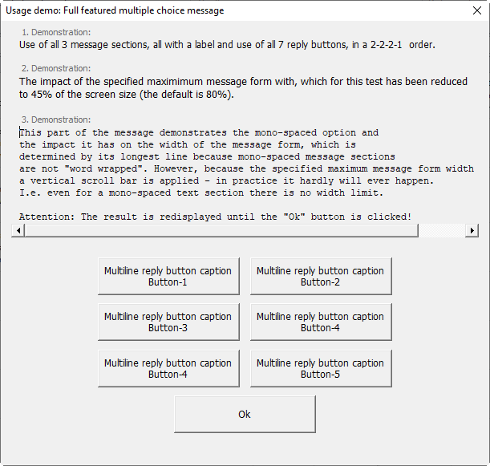

# Common VBA Message Service (a MsgBox Alternative)

[Abstract](#abstract)<br>
[Why an alternative MsgBox](#why-an-alternative-msgbox)<br>
[Installation](#installation)<br>
[Usage](#usage)<br>
&nbsp;&nbsp;&nbsp;[The _Box_ service](#the-box-service)<br>
&nbsp;&nbsp;&nbsp;[The _Dsply_ service](#the-dsply-service)<br>
&nbsp;&nbsp;&nbsp;[The _ErrMsg_ service](#the-errmsg-service)<br>
&nbsp;&nbsp;&nbsp;[The _Monitor_ service](#the-monitor-service)<br>

## Abstract
A flexible and powerful VBA MsgBox alternative coming in four flavors. **[Dsply](#the-dsply-service)** is for any common message, **[ErrMsg](#the-errmsg-service)** provides a comprehensive error message, **[Box](#the-box-service)** is a very much VBA MsgBox like service and **[Monitor](#the-monitor-service)** is a service to display the progress of a process.

## Why an alternative MsgBox?
The alternative implementation addresses many of the MsgBox's deficiencies - without re-implementing it to 100%.

|MsgBox|Alternative|
|------|-----------|
| The message width and height is limited and cannot be altered | The&nbsp;maximum&nbsp;width and&nbsp;height&nbsp;is&nbsp;specified as&nbsp;a percentage of the screen&nbsp;size&nbsp; which&nbsp;defaults&nbsp;to: 80%&nbsp;width and  90%&nbsp;height (hardly ever used)|
| When a message exceeds the (hard to tell) size limit it is truncated | When the maximum size is exceeded a vertical and/or a horizontal scroll bar is applied
| The message is displayed with a proportional font | A message may (or part of it) may be displayed mono-spaced |
| Composing a fair designed message is time consuming and it is difficult to come up with a satisfying result | Up&nbsp;to&nbsp;3&nbsp; _Message&nbsp;Sections_ each with an optional _Message Text Label_ and a _Mono-spaced_ option allow an appealing design without any extra  effort |
| The maximum reply _Buttons_ is 3 | Up to 7 reply _Buttons_ may be displayed in up to 7 reply _Button Rows_ in any order (=49 buttons in total) |
| The caption of the reply _Buttons_ is specified by a [value](<https://docs.microsoft.com/de-DE/office/vba/Language/Reference/User-Interface-Help/msgbox-function#settings>) which results in 1 to 3 reply _Buttons_ with corresponding untranslated! native English captions | The caption of the reply _Buttons_ may be specified by the [VB MsgBox values](<https://docs.microsoft.com/de-DE/office/vba/Language/Reference/User-Interface-Help/msgbox-function#settings>) **and** additionally by any multi-line text (see [Syntax of the _buttons_ argument](#syntax-of-the-buttons-argument) |
| vbApplicationModal or vbSystemModal, no vbModeless option | The message can be displayed both ways which _modal_ (the default) or _modeless_. _modal_ equals to vbApplicationModal, there is (yet) no vbSystemModal option.|
| Specifying the default button | The default button may be specified as index or as the displayed caption. However, it cannot be specified as vbOk, vbYes, vbNo, etc. |
| Display of an alert image (?, !, etc.) | (yet) not implemented |

## Installation
1. Download [fMsg.frm][1], [fMsg.frx][2], and [mMsg.bas][3] .
2. Import _fMsg.frm_ and _mMsg.bas_ to your VB-Project
4. In the VBE add a Reference to _Microsoft Scripting Runtime_
Note: The

## Usage
### The Box service
The _Box_ service mimics the _VBA.MsgBox_ by displaying a single message string like the _VBA.MsgBox Prompt_ argument. However, due to the use of the _fMsg_ form there is no limit in the length of the message string but the systems limit which is about 1GB. With the exception of the box_msg argument all other arguments are identical w\ith the __Dsply_ service - just prefixed with box_ instead of dsply_.

The _Box_ service has these named arguments:


| Argument                   | Meaning                                              |
|----------------------------|------------------------------------------------------|
| _box_title_                | String expression displayed in the window handle bar |
| _box\_msg_                 | String expression displayed
| _box\_monospaced_          | Boolean expression, defaults to False, displays the _box\_msg_ with a monospaced font
| _box\_buttons_             | Optional. Variant expression. Defaults to vbOkOnly. May be provided as a comma delimited String, a Collection, or a Dictionary, with each item specifying a displayed command button's caption or a button row break (vbLf, vbCr, or vbCrLf). Any of the items may be a string or a classic VBA.MsgBox values (see [The VBA.MsgBox buttons argument settings][4]. Items exceeding 49 captions are ignored, when no row breaks are specified max 7 buttons are displayed in a row.
| _box\_button\_default_      | Optional, numeric expression, defaults to 1, identifies the default button, i.e. the button which has the focus
| _box\_returnindex           | Optional, boolean expression, default to False, indicates that the return value for the clicked button will be the index rather than its caption string.
| _box\_width\_min_           | Optional, numeric expression, defaults to 400, the minimum width in pt for the display of the message. A value < 100 is interpreted as % of the screen size, a value > 100 as pt
| _box\_width\_max_           | Optional, numeric expression, defaults to 80, specifies the maximum message window width as % of the screen size. A value < 100 is interpreted as % of the screen size, a value > 100 as pt
| _box\_height\_max_          | Optional, numeric expression, defaults to 70, specifies the maximum message window height of the screen size. A value < 100 is interpreted as % of the screen size, a value > 100 as pt
| _box\_buttons\_width\_min_ | Optional, numeric expression, defaults to 70, specifies the minimum button width in pt

#### Using the _mMsg.Box_ service
```
Public Sub Demo_Box_Service()
    Const PROC          As String = "Demo_Box_service"
    Const BTTN_1        As String = "Button-1 caption"
    Const BTTN_2        As String = "Button-2 caption"
    Const BTTN_3        As String = "Button-3 caption"
    Const BTTN_4        As String = "Button-4 caption"
    Const DEMO_TITLE    As String = "Demonstration of the Box service"
    
    On Error GoTo eh
    Dim DemoMessage     As String
    
    DemoMessage = "The message : The ""Box"" service displays one string just like the VBA MsgBox. However, the monospaced" & vbLf & _
                  "              option allows a better layout for an indented text like this one for example. It should also be noted" & vbLf & _
                  "              that there is in fact no message width limit." & vbLf & _
                  "The buttons : 7 buttons in 7 rows are possible each with any caption string or a VBA MsgBox value. The latter may" & vbLf & _
                  "              result in more than one button, e.g. vbYesNoCancel." & vbLf & _
                  "The window  : When the message exceeds the specified maximum width a horizontal scroll-bar, when it exceeds" & vbLf & _
                  "              the specified maximum height a vertical scroll.bar is displayed  the message is displayed with a horizontal scroll-bar." & vbLf
    
    Select Case mMsg.Box( _
             box_title:=DEMO_TITLE _
           , box_msg:=DemoMessage _
           , box_monospaced:=True _
           , box_width_max:=50 _
           , box_buttons:=mMsg.Buttons(BTTN_1, BTTN_2, BTTN_3, BTTN_4, vbLf, vbYesNoCancel) _
           , box_button_default:=5 _
            )
        Case BTTN_1:    MsgBox """" & BTTN_1 & """ pressed"
        Case BTTN_2:    MsgBox """" & BTTN_2 & """ pressed"
        Case BTTN_3:    MsgBox """" & BTTN_3 & """ pressed"
        Case BTTN_4:    MsgBox """" & BTTN_4 & """ pressed"
        Case vbYes:     MsgBox """ Yes"" pressed"
        Case vbNo:      MsgBox """No"" pressed"
        Case vbCancel:  MsgBox """Cancel"" pressed"
    End Select

xt: Exit Sub

eh: If mMsg.ErrMsg(ErrSrc(PROC)) = vbYes Then: Stop: Resume
End Sub
```
The above code displays


### The _Dsply_ service
The service provides all features which make the difference to the VBA.MsgBox.

#### Syntax of the _Dsply_ service
`mMsg.Dsply(dsply_title, dsply_msg[, dsply_buttons][, dsply_button_default][, dsply_reply_with_index][, dsply_modeless][, dsply_min_width][, dsply_max_width][, dsply_max_height][, dsply_min_button_width])`

The _Dsply_ service has these named arguments:

| Part                        | Description             |
|-----------------------------|-------------------------|
| _dsply\_title_              | Required. String expression displayed in the title bar of the dialog box. If you omit title, the application name is placed in the title bar.|
| _dsply\_msg_                | Required. [UDT _TypeMsg_ ][#syntax-of-the-typemsgMsg-udt] expression providing 4 message sections, each with a label and the message text, displayed as the message in the dialog box. The maximum length of each of the four possible message text strings is only limited by the system's limit for string expressions which is about 1GB!. When one of the 4 message text strings consists of more than one line, they can be separated by using a carriage return character (Chr(13)), a linefeed character (Chr(10)), or carriage return - linefeed character combination (Chr(13) & Chr(10)) between each line.|
| _dsply\_buttons_            | Optional. Variant expression. Defaults to vbOkOnly. May be provided as a comma delimited String, a Collection, or a Dictionary, with each item specifying a displayed command button's caption or a button row break (vbLf, vbCr, or vbCrLf). Any of the items may be a string or a classic VBA.MsgBox values (see [The VBA.MsgBox buttons argument settings][4]. Items exceeding 49 captions are ignored, when no row breaks are specified max 7 buttons are displayed in a row.|
| _dsply\_button\_default_    | Optional, _Long_ expression, defaults to 1, specifies the index of the button which is the default button. |
| _dsply\_reply\_with\_index_ | Optional, _Boolean_ expression, defaults to False. When True the index if the pressed button is returned rather than its caption. |
| _dsply\_modeless_           | Optional, _Boolean_ expression, defaults to False. When True the message is displayed modeless.  |
| _dsply\_width\_min_         | Optional, _Single_ expression, defaults to 300 which interpreted as pt.                   |
| _dsply\_width\_max_         | Optional, _Single_ expression, Defaults to 80 which interpreted as % of the screen's width. |
| _dsply\_height\_max_        | Optional, _Single_ expression, defaults to 75 which is interpreted as % of the screen's height.|
| _dsply\_button\_width\_min_ | Optional,  _Single_ expression, defaults to 70 pt. Specifies the minimum width of the reply buttons, i.e. even when the displayed string is just Ok, Yes, etc. which would result in a button with much less width. |

#### Syntax of the _TypeMsg_ UDT
The syntax is described best as a code snippet using all options 
```
Dim Message As TypeMsg
With Message.Section(n)
    With .Label
        .FontBold = True
        .FontColor = rgbRed
        .FontItalic = True
        .FontName = "Tahoma"
        .FontSize = 9
        .FontUnderline = True
        .Monospaced = True ' FontName will be ignored and default to "Courier New"
        .Text As String
    End With
    With .Text
         .FontBold = True
        .FontColor = rgbRed
        .FontItalic = True
        .FontName = "Tahoma"
        .FontSize = 9
        .FontUnderline = True
        .Monospaced = True ' FontName will be ignored and default to "Courier New"
        .Text As String
```
Going with the defaults the minimum message text assignment (without a label) would be `Message.Section(1).Text.Text = "......"`

### The ErrMsg service
Provides the display of a well designed error message. Supports debugging when the Conditional Compile Argument 'Debugging = 1' which enable the Resume of the code line which caused the error. The following is a coding example which my personal standard. It uses an _[ErrSrc](errsrc-to-get-the-source-of-the-error-for-an-error-message)_ function which is module specific and returns '\<modulename>.\<procedurename>'.
```VB
Public Sub Test_ErrMsg_Service()
    Const PROC = "Test_ErrMsg_Service"
    
    On Error GoTo eh
    Dim i As Long
    i = i / 0
    
xt: Exit Sub

eh: If mMsg.ErrMsg(ErrSrc(PROC)) = vbYes Then: Stop: Resume
End Sub
```

Displays:<br>


Only when the Conditional Compile Argument 'Debugging = 1' the ErrMsg is displayed with Yes/No buttons and thus may return vbYes which means that the line which caused the error may be resumed by F8, F8.


#### Using the _Dsply_ service
The below code demonstrates most of the available features and message window properties.
```
Public Sub DemoMsgDsplyService_1()
    Const MAX_WIDTH     As Long = 50
    Const MAX_HEIGHT    As Long = 60
    
    Dim cll             As New Collection
    Dim i, j            As Long
    Dim Message         As TypeMsg
   
    With Message.Section(1)
        .Label.Text = "Demonstration overview:"
        .Label.FontColor = rgbBlue
        .Text.Text = "- Use of all 4 message sections" & vbLf _
                   & "- All sections with a label" & vbLf _
                   & "- One section mono-spaced exceeding the specified maximum message form width" & vbLf _
                   & "- Use of some of the 7 x 7 reply buttons in a 4-4-1 order" & vbLf _
                   & "- An an example for available text font options all labels in blue"
    End With
    With Message.Section(2)
        .Label.Text = "Unlimited message width!:"
        .Label.FontColor = rgbBlue
        .Text.Text = "Because this section's text is mono-spaced (which is not word-wrapped) and the maximum message form width" & vbLf _
                   & "for this demo has been specified " & MAX_WIDTH & "% of the screen width (the default would be 80%)" & vbLf _
                   & "the text is displayed with a horizontal scroll-bar. There is no message size limit for the display despite the" & vbLf & vbLf _
                   & "limit of VBA for text strings  which is about 1GB!"
        .Text.Monospaced = True
    End With
    With Message.Section(3)
        .Label.Text = "Unlimited message height!:"
        .Label.FontColor = rgbBlue
        .Text.Text = "Because this section text has many lines (line breaks)" & vbLf _
                   & "the default word-wrapping for this proportional-spaced text" & vbLf _
                   & "has not the otherwise usual effect. The message area thus" & vbLf _
                   & "exceeds the for this demo specified " & MAX_HEIGHT & "% of the screen size" & vbLf _
                   & "(defaults to 80%) it is displayed with a vertical scroll-bar." & vbLf _
                   & "So even a proportional spaced text's size - which usually is word-wrapped -" & vbLf _
                   & "is only limited by the system's limit for a String which is abut 1GB !!!"
    End With
    With Message.Section(4)
        .Label.Text = "Great reply buttons flexibility:"
        .Label.FontColor = rgbBlue
        .Text.Text = "This demo displays only some of the 49 possible reply buttons (7 rows by 7 buttons). " _
                   & "It also shows that a reply button can have any caption text and the buttons can be " _
                   & "displayed in any order within the 7 x 7 limit. Of course the VBA.MsgBox classic " _
                   & "vbOkOnly, vbYesNoCancel, etc. are also possible - even in a mixture." & vbLf & vbLf _
                   & "By the way: This demo ends only with the Ok button clicked and loops with all the other."
    End With
    '~~ Prepare the buttons collection
    For j = 1 To 2
        For i = 1 To 4
            cll.Add "Multiline reply" & vbLf & "button caption" & vbLf & "Button-" & j & "-" & i
        Next i
        cll.Add vbLf
    Next j
    cll.Add vbOKOnly ' The reply when clicked will be vbOK though
    
    While mMsg.Dsply(dsply_title:="Usage demo: Full featured multiple choice message" _
                   , dsply_msg:=Message _
                   , dsply_buttons:=cll _
                   , dsply_height_max:=MAX_HEIGHT _
                   , dsply_width_max:=MAX_WIDTH _
                    ) <> vbOK
    Wend
    
End Sub
```
which displays:



### The _Monitor_ service

The _Monitor_ service has the following named arguments
| Part                    | Description             |
|-------------------------|-------------------------|
| _mntr\_title_           | String expression, displayed as title of the message window. |
| _mntr\_msg_             | String expression, displayed as the message/information. |
| _mntr\_header_          | String expression, defaults to vbNullString, string displayed above _mntr\_msg_ |
| _mntr\_footer_          | String expression, defaults to "Process in progress! Please wait.", displayed below _mntr\_msg_ 
| _\mntr\_msg\__ |append_ | As Boolean = True, |
| _mntr\_msg\_monospaced_ | _Boolean_ expression, defaults to False. When True the message string is displayed with a monospaced font. |
| _mntr\_width\_min_      | _Long_ expression, defaults to 400, which interpreted as pt. |
| _mntr\_width\_max_      | _Long_ expression, defaults to 80, which is interpreted as % of the screen's width. |
| _mntr\_height\_max_     | |

#### Usage of the _Monitor_ service
The below code example
```vb
Public Sub Demo_Monitor_Service()
    Const PROC              As String = "Demo_Monitor_Service"
    Const MONITOR_HEADER    As String = " No. Status   Step"
    Const MONITOR_FOOTER    As String = "Process finished! Close this window"
    Const PROCESS_STEPS     As Long = 12
    
    On Error GoTo eh
    Dim i               As Long
    Dim lWait           As Long
    Dim MonitorTitle    As String
    Dim ProgressStep    As String
    
    MonitorTitle = "Demonstration of the monitoring of a process step by step"
    mMsg.Form MonitorTitle, frm_unload:=True ' Ensure there is no process monitoring with this title still displayed
        
    For i = 1 To PROCESS_STEPS
        '~~ Preparing a process step message string
        ProgressStep = mBasic.Align(i, 4, AlignRight, " ") & _
                   mBasic.Align("Passed", 8, AlignCentered, " ") & _
                   Repeat(repeat_n_times:=Int(((i - 1) / 10)) + 1, repeat_string:="  " & _
                   mBasic.Align(i, 2, AlignRight) & _
                   ".  Follow-Up line after " & _
                   Format(lWait, "0000") & _
                   " Milliseconds.")
        
        If i < PROCESS_STEPS Then
            '~~ Steps 1 to n - 1
            mMsg.Monitor mntr_title:=MonitorTitle _
                       , mntr_msg:=ProgressStep _
                       , mntr_msg_monospaced:=True _
                       , mntr_header:=MONITOR_HEADER
            
            '~~ Simmulation of a process
            lWait = 100 * i
            DoEvents
            Sleep 200
        
        Else
            '~~ The last step, separated in order to display the footer along with it
            mMsg.Monitor mntr_title:=MonitorTitle _
                       , mntr_msg:=ProgressStep _
                       , mntr_header:=MONITOR_HEADER _
                       , mntr_footer:=MONITOR_FOOTER
        End If
    Next i
    
xt: Exit Sub

eh: If mMsg.ErrMsg(ErrSrc(PROC)) = vbYes Then: Stop: Resume
End Sub
```
displays:<br>


#### Proportional versus Mono-spaced
##### _Monospaced_ = True

Because the text is ++not++  "wrapped" the width of the _Message Form_ is determined by the longest text line (up to the _Maximum Form Width_ specified). When the maximum width is exceeded a vertical scroll bar is applied.<br>Note: The title and the broadest _Button Row_ May still determine an even broader final _Message Form_.

##### _Monospaced_ = False (default)
Because the text is "wrapped" the width of a proportional-spaced text is determined by the current form width.<br>Note: When a message is displayed exclusively proportional-spaced the _Message Form_ width is determined by the length of the title, the required space for the broadest _Buttons Row_ and the specified _Minimum Form Width_.

##### ErrSrc to get the source of the error for an error message
```VB
Private Function ErrSrc(ByVal proc_name As String) As String
    ErrSrc = "<the name of the module goes here>." & proc_name
End Function
```


[1]:https://gitcdn.link/repo/warbe-maker/Common-VBA-Message-Service/edit/master/source/fMsg.frm
[2]:https://gitcdn.link/repo/warbe-maker/Common-VBA-Message-Service/edit/master/source/fMsg.frx
[3]:https://gitcdn.link/repo/warbe-maker/Common-VBA-Message-Service/edit/master/source/mMsg.bas
[4]:https://docs.microsoft.com/de-DE/office/vba/Language/Reference/User-Interface-Help/msgbox-function
